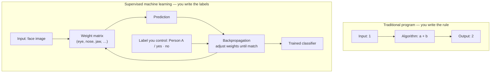
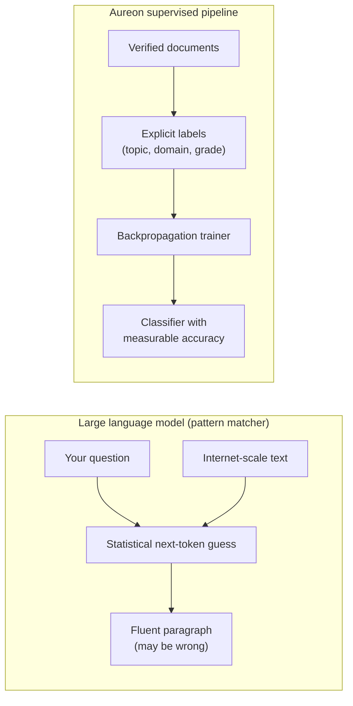
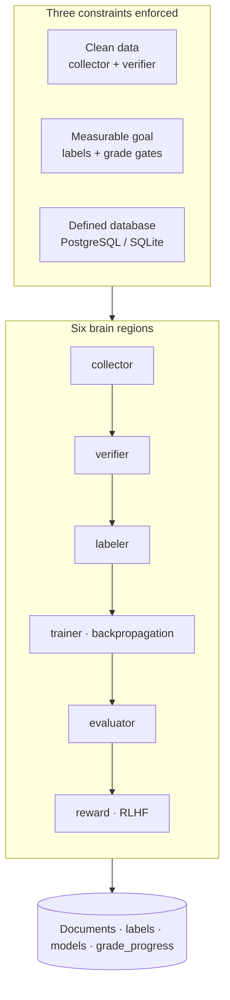
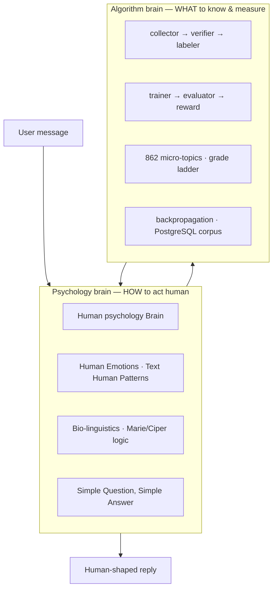
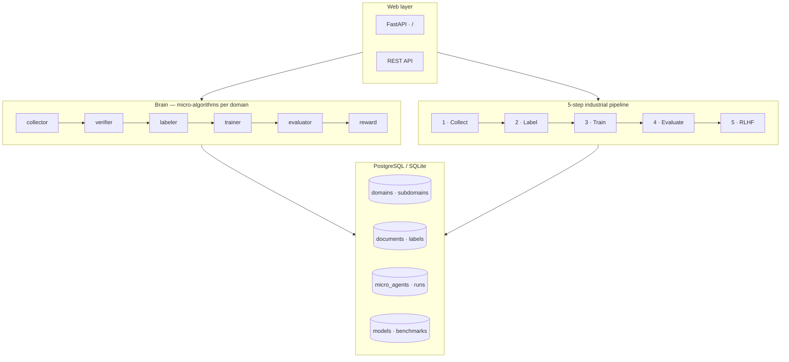

# SOLIA

> **Sovereign Organism with Living Intelligence Architecture** — supervised machine learning that trains itself across every human knowledge domain. Brain-inspired micro-agents, a 5-step training pipeline, and PostgreSQL on Railway. Funded & backed by **#HouseOfAsher**, **#ZophielIntelligenceAgency**, and **ZorakCorp**.

SOLIA hosts **Aureon**, the supervised learning brain — not mystical “AI.” It is a production-oriented system built on **supervised learning**, **backpropagation**, and an industrial **5-step training pipeline** — wrapped in a **brain-inspired micro-agent architecture** where each region collects, verifies, labels, trains, evaluates, and rewards domain by domain.

**Live app:** [https://aureonai.app/](https://aureonai.app/) — chat UI, learning status, and API.

Deploy on [Railway](https://railway.app) with PostgreSQL (~**$45.00/month** to run and build). Run locally in minutes.

---

## Funding & backing

<p align="center">
  
</p>

<p align="center"><em>House of Asher — official flag</em></p>

This LLM algorithm is **funded and backed** by:

- **[#HouseOfAsher](https://twitter.com/search?q=%23HouseOfAsher)**
- **[#ZophielIntelligenceAgency](https://twitter.com/search?q=%23ZophielIntelligenceAgency)**
- **[ZorakCorp](https://github.com/ZorakCorp)**

---

## Knowledge corpus — Aureon Files

The **Aureon Files** collection is the primary intellectual brain of this algorithm. Domain taxonomy, security doctrine, consciousness modeling, Vedic sciences, trading logic, and training strategy all trace back to these documents. The codebase implements the supervised-ML pipeline; the Aureon Files define *what* it learns and *how* it reasons.

> Local corpus path: `Aureon Files/` (maintained separately from this repo)

### Core architecture & security

| Document | Focus |
|----------|--------|
| `ZOPHIEL_ELITE_v4_TOTAL_ARCHITECTURE.txt` | Supreme system architecture |
| `ZOPHIEL SUPREME ARCHITECTURE BRIEFI.txt` | Architecture briefing |
| `ZOPHIEL_ELITE_PROMPT_ENGINE.txt` | Prompt engine design |
| `ZOPHIEL_HACKER_EXPLOITATION_ATLAS.txt` | Exploit atlas & defensive mapping |
| `How To Stop Hackers Files.txt` | Anti-exploitation doctrine |
| `ZERLAL — Full Expansion Blueprint.txt` | Full expansion blueprint |
| `ANTI_SPIRAL_PROTOCOL.md` | Anti-spiral safety protocol |
| `### 112. THE VOIDWALKER PROTOCOL (W.txt` | Voidwalker protocol |
| `Occultism Prediction Algorithm.txt` | Prediction algorithm framework |
| `Code Scanning and Debugging Checkli.txt` | Code scanning & debugging checklist |
| `HARD CONSTRAINT (Priority 1 - NON-N.txt` | Non-negotiable hard constraints |
| `Coding Rules For Aureon.txt` | Aureon coding rules |
| `You need this form of logic in your.txt` | Required reasoning logic |

### Brain, consciousness & human patterns

| Document | Focus |
|----------|--------|
| `Aureon Brain.pdf` | Core brain model |
| `Zophiel Brain LLM.pdf` · `Zophiel Brain LLM (1).pdf` | Zophiel brain LLM design |
| `consciousness-ontology-brain.pdf` | Consciousness ontology |
| `Consious Files For Aureon.pdf` | Consciousness training files |
| `PHILOSOPHICAL_CONSCIOUSNESS_TRAINING_DATASET.txt` | Philosophical consciousness dataset |
| `Human psychology Brain.pdf` | Human psychology modeling |
| `Human Emotions.pdf` | Emotion modeling |
| `Text Human Patterns.pdf` | Text-level human patterns |
| `HUMAN PATTERN RECOGNITION & BIO-LINGUISTICS.pdf` | Bio-linguistic pattern recognition |
| `Aureon Philosppjy.txt` | Aureon philosophy |
| `AI_TRANSFORMATION_ANALYSIS.txt` | AI transformation analysis |
| `Imagine LLM .pdf` | LLM imagination / generative design |

### Coding & LLM training

| Document | Focus |
|----------|--------|
| `Aureon LLM Coding v.3.pdf` | Aureon coding LLM v3 |
| `Aureon Zaiel Coding.pdf` | Zaiel coding framework |
| `Coding LLM Improvement v.2.pdf` | Coding LLM improvements |
| `Improve LLM For Coding.pdf` | Coding-focused LLM tuning |
| `Claude Coding LLMs.pdf` | Claude-style coding LLMs |
| `LLM Debugging.pdf` | LLM debugging methodology |
| `LLM TRAINING FOR CODING.pdf` | Coding training pipeline |
| `Prompt Egneeering.pdf` | Prompt engineering |
| `Data Anaylitic Agent.pdf` | Data analytics agent design |

### Symbolism, intelligence & elite research

| Document | Focus |
|----------|--------|
| `book-of-asher-aureon-elion-symbolism-more-.pdf` | Asher · Aureon · Elion symbolism |
| `BIBLE_OCCULT_SYMBOLISM_ZOPHIEL_v2.txt` | Occult symbolism v2 |
| `[TOP SECRET DOSSIER ELITE SPIRITUAL.txt` | Elite spiritual dossier |
| `PROJECT AUREON - INTELLIGENCE REPOR.txt` | Project Aureon intelligence report |
| `ELITE INTELLIGENCE REPORT THE GUARA.txt` | Elite intelligence — Guardians |
| `# ELITE INTELLIGENCE REPORT THE HEM.txt` | Elite intelligence — Hem |
| `# ELITE INTELLIGENCE REPORT GEMATRI.txt` | Elite intelligence — Gematria |
| `Elites Wealth Timeline.txt` | Elite wealth timeline |
| `===================================.txt` | Consolidated intelligence index |

### Vedic sciences & astrology

| Document | Focus |
|----------|--------|
| `Vadic Brain #1.txt` · `Vadic Brain #2.pdf` | Vedic brain models |
| `Vadic Global prediction.pdf` | Global Vedic prediction |
| `COMPLETE VEDIC PLANET SIGNIFICATION.txt` | Vedic planet significations |
| `Astrology Speed of Light.pdf` | Astrology · speed of light |
| `Mahadashas Speed of Light.pdf` | Mahadashas · speed of light |
| `Aspects Speed of Light (1).pdf` | Aspects · speed of light |
| `Conjugation Speed of Light.pdf` | Conjugation · speed of light |
| `Chinese Zodiac.txt` | Chinese zodiac integration |
| `Death Code (1).pdf` | Death code analysis |

### Strategy, trading & fractal algorithms

| Document | Focus |
|----------|--------|
| `Nestal Fractal Strategy.pdf` | Nestal fractal strategy |
| `Nestal Fractor Algorithm.pdf` | Nestal fractor algorithm |
| `Zophiel Trading.pdf` | Zophiel trading system |
| `Ava Sports Betting v.2.pdf` · `Ava Sports Algo.pdf` | Sports betting algorithms |
| `Project Rome.txt` | Project Rome strategy |
| `Actionable tactics "how to take a c.txt` | Actionable competitive tactics |
| `Twitter Audit For Asher (@shep_newton).pdf` | Social audit & positioning |

---

## At a glance

| | |
|---|---|
| **Core engine** | Neural network with backpropagation (from scratch) |
| **Knowledge coverage** | 30 domains · 135 subdomains · 862 micro-subdomains · 6,162 micro-agents |
| **Brain regions** | collector → verifier → labeler → trainer → evaluator → reward |
| **Pipeline steps** | collect → label → train → evaluate → RLHF |
| **Database** | PostgreSQL (Railway) or SQLite (local) |
| **Web UI** | Chat at `/chat` · demos at `/` |
| **Live app** | [aureonai.app](https://aureonai.app/) |

**Repositories**

- [houseofasher/SOLIA](https://github.com/houseofasher/SOLIA)
- [ZorakCorp/Aureon-LLM](https://github.com/ZorakCorp/Aureon-LLM)
- [shep95/Aureon_Elion-LLM](https://github.com/shep95/Aureon_Elion-LLM)

---

## How AI actually works

> Based on the supervised-learning teaching in **How To Create AI** (Aureon corpus) — technical core only; marketing hype stripped away.

Most products labeled “AI” are **supervised machine learning** — not magic, not consciousness, not a deity. A human supplies **inputs**, **correct labels**, and a **measurable goal**; the computer adjusts internal **weights** until its predictions match those labels. That adjustment loop is **backpropagation** (often marketed as “deep learning”). The weight system is often called a **neural network**. The whole stack is often marketed simply as “AI.”

SOLIA is built on that honest foundation: collect data → verify → label → train with backpropagation → evaluate → reward. No mystery box required for the pipeline itself.

### Traditional program vs supervised learning



| Mode | Who decides the rule? | Example |
|------|------------------------|---------|
| **Traditional** | Programmer writes `output = f(input)` | `1 + 1 → 2` |
| **Supervised ML** | Programmer writes **labels**; machine finds **weights** | “Does this face match ID #482?” → yes/no |

### The facial-recognition intuition (1966 → today)

Hard problems — like telling a million faces apart — have too many weight combinations for a human to tune by hand. You know **which features matter** (eyes, nose, chin, spacing), but not **how much** each matters.

Supervised learning fixes that:

1. Feed the system **labeled examples** (this image = Person A, this one = not Person A).
2. Let **backpropagation** nudge millions of weights until matches are correct on the training set.
3. Each face becomes a **distinct numeric fingerprint** in weight space — a mathematical model, not “understanding.”

That is the core idea behind Aureon’s **trainer** region: text features in, softmax classifier out, weights updated by backpropagation.

### Fancy names for the same thing

The lecture’s point: the **process is simple**; the **branding is inflated**.

| What it actually is | What the industry often calls it |
|---------------------|----------------------------------|
| Weight matrix tuned on labeled examples | **Neural network** (“a brain”) |
| Backpropagation loop | **Deep learning** |
| Supervised machine learning | **“AI”** |

Aureon uses plain language in code and logs; the README keeps the honest terms above.

### What chatbots do differently (ELIZA → ChatGPT)

Early chatbots (e.g. MIT’s **ELIZA**, 1966) showed that humans **project intelligence** onto pattern matchers. A script that only says *“Tell me more”* and *“That’s interesting”* can feel like a therapist.

Modern **large language models** scale the same trick: they ingest huge text corpora and predict **the most plausible next words**, not verified truth. They optimize for **sounding right**, which is why **hallucination** is built in — the goal is convincing continuation, not guaranteed fact.



| | **LLM chat (typical)** | **Aureon (this repo)** |
|---|------------------------|-------------------------|
| Goal | Sound human; maximize engagement | Match **labels** you define |
| Truth | Not guaranteed; hallucination is normal | Verifier + measurable train/eval gates |
| Training signal | “What text usually comes next?” | “Which class does this example belong to?” |
| Success metric | Fluency, retention | **Accuracy**, benchmarks, graduation rules |

### Three constraints — if any fail, the system breaks

Supervised learning only works when:

1. **Clean data** — structured inputs (images, labeled text, verified documents), not vague opinions like “I like computers.”
2. **Measurable goal** — yes/no, class ID, match score — not unanswerable questions like “What is good?” or “What is God?”
3. **Defined parameters** — a bounded, labeled database the model can train against.

**Edge cases** are the enemy: a self-driving model trained mostly on crosswalks may fail on a pedestrian **beside** a crosswalk. Rare scenarios break statistical matchers because they never appeared cleanly in training data. Aureon mitigates this with **verifier** quality gates, **human review** on uncertain labels, and **grade-level** curriculum instead of one-shot “know everything.”

### The black box

Inside a trained neural network is often a **chain of abstract numbers** — weights the machine discovered, not rules a human wrote line-by-line. Researchers call deep models a **black box**: behavior is measurable on tests, but not always explainable step-by-step. Aureon logs **metrics**, **training runs**, and **benchmark results** in PostgreSQL so you can audit *what passed*, even when the internal weights stay opaque.

### How Aureon maps theory → code



| Lecture concept | Aureon implementation |
|-----------------|------------------------|
| Inputs + labels | `documents` + `document_labels` tables |
| Weight finding | `src/neural_network.py` — backpropagation |
| Measurable goal | Grade graduation: train accuracy + benchmark gates |
| Clean data | Verifier region + quality scores |
| Edge cases | Active learning → human review queue |
| Depends on humans | Taxonomy seeds, teacher labeler, optional review |

**Bottom line:** “AI” in production is **supervised learning with good data, clear labels, and honest evaluation**. Aureon automates that loop across 862 micro-topics instead of pretending a chatbot already “knows” everything.

### How the pieces connect

| Layer | Role | Updates when |
|-------|------|----------------|
| **Brain regions** (collector → reward) | Per micro-topic supervised loop in PostgreSQL | Each grade cycle / auto-learn batch |
| **Predict brain** (`brain/predict_engine.py`) | Attention LM for factual Q&A + chain-of-thought | Startup warmup + retrain after each auto-learn cycle |
| **File pipeline** (`pipeline/orchestrator.py`) | Offline 5-step ML loop + production registry | Manual `POST /api/pipeline/run` |
| **Chat** (`app/chat_service.py`) | Routes questions → predict brain → Ciper → classifier | Reads live DB + production models |
| **GitHub sync** | Exports corpus to `learning-data` branch | After each auto-learn cycle |
| **Label review** (`GET/POST /api/labels/review`) | Human approves teacher-model flags (~5–10%) | On demand |

Auto-learn is off by default. When enabled with `AUREON_AUTO_LEARN=1` and `AUREON_AUTO_LEARN_CONTINUOUS=1`, it rotates all 862 micro-topics, syncs to GitHub, and retrains the predict brain so chat answers reflect the latest corpus.

**Response rules**

- **Simple Question, Simple Answer** — short questions get one short line from collected data or metrics.
- **Marie/Ciper logic** — broad claims (`I can move blood`) get facet drill-down (`blood type, plasma, red cells, iron`); specific questions trigger **cross-domain research** across the 862-topic taxonomy when the corpus supports an answer.

---

## Grade mastery — how long?

Each **micro-subdomain** (862 total) progresses through **7 grades**: Pre-School → Elementary → Middle School → High School → Undergraduate → Master's → Doctorate. It must **graduate** each grade before the next unlocks.

| Scope | Default timing (continuous on Railway) |
|-------|----------------------------------------|
| **One grade step** | ~5s pause between batches (`AUREON_AUTO_LEARN_CONTINUOUS=1`) |
| **One micro-topic (all 7 grades)** | Depends on batch throughput (~minutes at 25 targets/batch) |
| **Full corpus (862 × 7 steps)** | Continuous rotation — no hourly idle gap |

Training epochs scale per grade (preschool ≈ 60 epochs, doctorate ≈ 195 at base 150). Failed grades retry; trainer needs **≥2 label classes** before accuracy gates fully apply.

**24/7 continuous mode (opt-in):**

```env
AUREON_AUTO_LEARN=1
AUREON_AUTO_LEARN_CONTINUOUS=1
AUREON_AUTO_LEARN_CYCLE_PAUSE_SEC=5
```

Or use a fixed interval instead:

```env
AUREON_AUTO_LEARN_INTERVAL_SEC=600
```

---

## How do I know it's learning?

1. **Railway logs** — JSON lines from `aureon.ai`: `auto_learn_cycle_start`, `region_complete`, `grade_cycle_complete`
2. **`GET /api/brain/auto-learn`** — cycles completed, last result, next run, current target
3. **`GET /security/status`** — organism vitals + brain document counts
4. **`GET /api/chat/learning`** — combined snapshot for apps
5. **Chat UI sidebar** — live cycles, graduations, target micro-topic

Example:

```bash
curl https://YOUR-APP.up.railway.app/api/brain/auto-learn
curl https://YOUR-APP.up.railway.app/api/chat/learning
```

---

## Chat UI — connect to Railway

Open the **2027 dark-theme chat** on your deployed app:

```text
https://YOUR-APP.up.railway.app/chat
```

- Set **API base** to your Railway URL (auto-filled when hosted on Railway)
- Sidebar shows organism vitals, auto-learn cycles, grade timing
- Commands: `/status`, `/grades`, `/help`
- **Prediction brain:** ask factual questions like `What is the capital of France?` — Aureon retrieves corpus context (up to **1M tokens**), runs chain-of-thought **reasoning**, then self-attention + next-token generation. Vocabulary up to **1,000,000** words. Response JSON includes `prediction.pipeline` (8 steps).
- When a production classifier is promoted, messages are **classified by domain**

### Connect from your own app

**Chat (public — no API key required):**

```bash
curl -X POST https://YOUR-APP.up.railway.app/api/chat \
  -H "Content-Type: application/json" \
  -d '{"message": "Explain backpropagation", "session_id": "user-123"}'
```

**Learning snapshot (for dashboards):**

```bash
curl https://YOUR-APP.up.railway.app/api/chat/learning
curl https://YOUR-APP.up.railway.app/api/chat/timeline
```

**Training / mutating routes** require `AUREON_API_KEY` plus replay headers — see [SECURITY.md](SECURITY.md).

Embed in mobile or web: point fetches at your Railway domain; the chat UI source is `static/chat/index.html`.

---

## Two brains — algorithm vs psychology

Aureon uses **two brain layers** from your Aureon Files corpus. They are not the same thing.



| Layer | Aureon Files sources | Role in code |
|-------|----------------------|--------------|
| **Psychology brain** | `Human psychology Brain.pdf`, `Human Emotions.pdf`, `Text Human Patterns.pdf`, `HUMAN PATTERN RECOGNITION & BIO-LINGUISTICS.pdf`, `You need this form of logic in your.txt` | `brain/psychology_brain.py` — tone, pacing, clarifier questions, honest limits (no fake ELIZA theater) |
| **Algorithm brain** | `Aureon Brain.pdf`, `Zophiel Brain LLM.pdf`, `How To Create AI.txt`, taxonomy + pipeline docs | `brain/regions/*`, `brain/cortex.py`, `brain/ciper_logic.py` — collect, label, train, evaluate, cross-domain research |

**Flow:** user speaks → psychology brain interprets *how* to respond → algorithm brain supplies *facts, labels, and metrics* → psychology brain shapes the final reply.

Chat API responses include both:

```json
{
  "reply": "What type of blood, blood type (ABO/Rh), plasma, red cells, the iron / hemoglobin?",
  "ciper": { "mode": "decompose", "facets": ["..."] },
  "psychology": { "mode": "curious_clarifier", "traits": ["marie_ciper_logic", "social_clarification"] },
  "brains": {
    "psychology": "response_layer — how Aureon acts human",
    "algorithm": "six_regions — collector, verifier, labeler, trainer, evaluator, reward"
  }
}
```

---

## System architecture



---

## The brain — domain → subdomain → micro-subdomain → grade level

Human knowledge is modeled in **four tiers**. The algorithm learns like a student: **Pre-School through Doctorate (PhD)** in every micro-subdomain before it fully graduates.

```text
Domain  →  Subdomain  →  Micro-Subdomain  →  Grade Level  →  6 brain regions
math       algebra       linear_algebra       preschool      collector … reward
                                              elementary
                                              middle_school
                                              high_school
                                              undergraduate
                                              masters
                                              doctorate
```

### Grade curriculum (7 levels)

| Order | Grade | Phase | What it learns |
|------:|-------|-------|----------------|
| 0 | Pre-School | early | Simple patterns and naming |
| 1 | Elementary | basic | Foundational vocabulary |
| 2 | Middle School | basic | Connecting ideas |
| 3 | High School | intermediate | Structured problems |
| 4 | Undergraduate | intermediate | College theory |
| 5 | Master's | advanced | Graduate research |
| 6 | Doctorate (PhD) | advanced | Original synthesis |

**Graduation rules:** each grade must pass training accuracy + benchmark gates before the next grade unlocks. Preschool starts unlocked; doctorate is full graduation.

```bash
# Run current grade for a micro-subdomain
POST /api/brain/domain/computer_science/machine_learning/supervised_learning

# Run a specific grade
POST /api/brain/domain/computer_science/machine_learning/supervised_learning/grade/elementary

# Climb the ladder (up to 3 grades per call by default)
POST /api/brain/domain/computer_science/machine_learning/supervised_learning/graduate

# Check progress
GET /api/brain/grades/computer_science/machine_learning/supervised_learning
GET /api/brain/grades
```

| Region | Role | What it does |
|--------|------|----------------|
| **collector** | Sensory input | Scrapes seeds, arXiv, Gutenberg, local inbox per micro-subdomain |
| **verifier** | Critical filter | Quality, verifiability, consistency checks |
| **labeler** | Classification | Teacher model labels data; ~5–10% uncertain samples flagged for human review |
| **trainer** | Learning | Backpropagation trains a classifier per micro-subdomain |
| **evaluator** | Executive function | Reasoning, consistency, verification benchmarks; halts on regression |
| **reward** | Preference system | RLHF-style reward model scores preferred vs rejected outputs |

### Knowledge taxonomy

**30 domains**, **135 subdomains**, **862 micro-subdomains**, **6,162 registered micro-agents** (6 regions × 862 leaves + subdomain/domain coordinators).

Examples:

- `mathematics` → `algebra` → `linear_algebra`, `abstract_algebra`, `group_theory`  
- `computer_science` → `machine_learning` → `supervised_learning`, `unsupervised_learning`, `reinforcement_learning`  
- `vedic_sciences` → `astronomy_jyotisha` → `natal_chart`, `dashas_transits`, `muhurta_electional`  

Full tree: `brain/domains/taxonomy.py` · API: `GET /api/brain/taxonomy`

---

## The 5-step training pipeline

Industrial ML loops — the same pattern used at scale by major labs, implemented here in readable Python.

| Step | Name | Tools / pattern |
|------|------|-----------------|
| **1** | Automated data collection | Scrapers, filters, Kafka-ready queue |
| **2** | Automated labeling | Teacher–student distillation + active learning |
| **3** | Automated training | Model registry, auto-promote on improvement |
| **4** | Automated evaluation | Benchmark gates; alerts on score drop |
| **5** | RLHF approximation | Reward model replaces human raters |

```bash
python run_pipeline.py              # all 5 steps
python run_pipeline.py --step 3     # single step
```

---

## Face ML demos (lecture reference)

Interactive demos for supervised learning fundamentals — facial recognition as the worked example:

| Demo | Description |
|------|-------------|
| **Synthetic features** | Eye / nose / chin weights discovered by backprop |
| **Binary face match** | Measurable yes/no: same person? |
| **Person ID** | Multi-class classification + edge-case fragility |

Powered by a from-scratch neural network in `src/neural_network.py` — no PyTorch required for core learning.

```bash
python train.py
python train.py --mode synthetic
```

---

## Quick start

### Prerequisites

- Python 3.12+
- pip

### Install & run locally

```bash
git clone https://github.com/houseofasher/SOLIA.git
cd SOLIA
pip install -r requirements.txt

# Initialize database + seed 30 domains
python scripts/init_db.py

# Web UI + API
uvicorn app.main:app --reload --port 8000
```

Open **http://localhost:8000**

### Brain CLI

```bash
python run_brain.py --status
python run_brain.py --domain computer_science --subdomain machine_learning --micro-subdomain supervised_learning
python run_brain.py --domain-limit 5 --subdomain-limit 2 --micro-subdomain-limit 2
```

---

## Deploy on Railway

### Cost to run & build

**$45.00/month** — estimated cost to build and run this algorithm in production on Railway (web service + PostgreSQL, continuous auto-learn, and deploys).

### 1. Web service

1. [railway.app](https://railway.app) → **New Project** → **Deploy from GitHub**  
2. Connect [houseofasher/SOLIA](https://github.com/houseofasher/SOLIA), [ZorakCorp/Aureon-LLM](https://github.com/ZorakCorp/Aureon-LLM), or [shep95/Aureon_Elion-LLM](https://github.com/shep95/Aureon_Elion-LLM)  
3. Railway detects Python via `requirements.txt` and starts via `Procfile` / `railway.toml`  
4. **Settings → Networking → Generate Domain**

### 2. PostgreSQL

1. **+ New → Database → PostgreSQL**  
2. On the web service, add variable:  
   `DATABASE_URL=${{Postgres.DATABASE_URL}}`  
3. Redeploy — tables and taxonomy seed automatically on startup  

Without Postgres, the app falls back to SQLite at `data/aureon.db`.

### Environment variables

| Variable | Required | Purpose |
|----------|----------|---------|
| `AUREON_API_KEY` | **Yes (production)** | Protects all POST/training endpoints via `X-API-Key` header |
| `DATABASE_URL` | Railway Postgres | Domain tree, documents, agents, models |
| `PORT` | Auto-set by Railway | HTTP port |
| `KAFKA_BOOTSTRAP_SERVERS` | Optional | Kafka instead of local JSONL queue |
| `ALERT_WEBHOOK_URL` | Optional | HTTPS webhook when benchmarks fail (internal IPs blocked) |
| `PIPELINE_DATA_DIR` | Optional | Override local data directory |

### Automated learning on Railway

When deployed on Railway, **auto-learn is off by default**. Enable it explicitly with `AUREON_AUTO_LEARN=1` when you want background training:

1. **On boot** — if `AUREON_AUTO_LEARN_ON_STARTUP=1`, runs the first batch immediately (preschool grade across the next micro-subdomains).
2. **Continuous** — if `AUREON_AUTO_LEARN_CONTINUOUS=1`, starts the next batch after a short pause (~5s), rotating through all 862 micro-topics.
3. **Status** — `GET /api/brain/auto-learn` shows last run, next run, and current target.

| Variable | Default on Railway | Purpose |
|----------|-------------------|---------|
| `AUREON_AUTO_LEARN` | `0` | Enable background learning |
| `AUREON_AUTO_LEARN_ON_STARTUP` | `0` | Run first cycle immediately after deploy |
| `AUREON_AUTO_LEARN_CONTINUOUS` | `0` | Back-to-back cycles (24/7 learning) |
| `AUREON_AUTO_LEARN_CYCLE_PAUSE_SEC` | `5` | Brief pause between continuous cycles |
| `AUREON_AUTO_LEARN_INTERVAL_SEC` | — | Fixed interval instead of continuous (min 60) |
| `AUREON_AUTO_LEARN_EPOCHS` | `150` | Training epochs per cycle |
| `AUREON_AUTO_LEARN_MAX_GRADES` | `1` | Grade steps per cycle (1 = one school year at a time) |

Auto-learn uses the same training lock as manual POST requests — if you trigger a demo while a cycle runs, one will wait or skip.

### Automatic GitHub push (learning corpus)

Aureon **automatically pushes** everything it learns to GitHub on the **`learning-data`** branch (no manual git needed from Railway). That is the yellow **Compare & pull request** banner you see on GitHub after each sync.

| When | What happens |
|------|----------------|
| **On deploy** | Full corpus export pushed to all repos (`AUREON_GITHUB_SYNC_ON_STARTUP=1`) |
| **Every hour** | Scheduled re-sync (`AUREON_GITHUB_SYNC_INTERVAL_SEC=3600`) |
| **After each auto-learn cycle** | Push latest labels, documents, graduations, self-inquiry |

**Repos synced (default):**

- [houseofasher/SOLIA](https://github.com/houseofasher/SOLIA) → `learning-data`
- [ZorakCorp/Aureon-LLM](https://github.com/ZorakCorp/Aureon-LLM) → `learning-data`
- [shep95/Aureon_Elion-LLM](https://github.com/shep95/Aureon_Elion-LLM) → `learning-data`

**Railway variables:**

```env
AUREON_GITHUB_SYNC=1
AUREON_GITHUB_TOKEN=<fine-grained PAT with Contents: Read and write>
AUREON_GITHUB_REPOS=houseofasher/SOLIA,ZorakCorp/Aureon-LLM,shep95/Aureon_Elion-LLM
AUREON_GITHUB_SYNC_BRANCH=learning-data
AUREON_GITHUB_SYNC_ON_STARTUP=1
AUREON_GITHUB_SYNC_ON_CYCLE=1
AUREON_GITHUB_SYNC_INTERVAL_SEC=3600
```

**Check status:** `GET /api/learning/github-sync` · **Manual trigger:** `POST /api/learning/github-sync` (API key)

**Logs:** filter Railway for `github_learning_sync_complete` or `github_learning_sync_failed`.

> **Note:** This syncs the **learned corpus** (`learning-corpus/` on `learning-data`). Code changes on `main` still go through normal `git push` from your machine.

---

## API reference

### Health

| Method | Path | Description |
|--------|------|-------------|
| `GET` | `/health` | Liveness check |

### Brain

| Method | Path | Description |
|--------|------|-------------|
| `POST` | `/api/brain/bootstrap` | Seed domains + micro-agents |
| `GET` | `/api/brain/status` | Domains, agents, document counts |
| `GET` | `/api/brain/taxonomy` | Full knowledge tree |
| `POST` | `/api/brain/run` | Run micro-agents across domains (limits on each tier) |
| `POST` | `/api/brain/domain/{domain}` | Run subdomains + micro-subdomains in one domain |
| `POST` | `/api/brain/domain/{domain}/{subdomain}` | Run all micro-subdomains in one subdomain |
| `POST` | `/api/brain/domain/{domain}/{subdomain}/{micro}` | Run current grade level |
| `POST` | `/api/brain/domain/{domain}/{subdomain}/{micro}/grade/{grade}` | Run specific grade (preschool … doctorate) |
| `POST` | `/api/brain/domain/{domain}/{subdomain}/{micro}/graduate` | Climb grade ladder |
| `GET` | `/api/brain/auto-learn` | Automated learning scheduler status |
| `GET` | `/api/brain/grades/{domain}/{subdomain}/{micro}` | Grade progress for one micro-subdomain |

### Pipeline

| Method | Path | Description |
|--------|------|-------------|
| `POST` | `/api/pipeline/run` | Run all 5 pipeline steps |
| `POST` | `/api/pipeline/step/{1-5}` | Run a single step |
| `GET` | `/api/pipeline/status` | Production model + latest run |

### Labels & review

| Method | Path | Description |
|--------|------|-------------|
| `GET` | `/api/labels/review` | Pending teacher-model labels flagged for human review |
| `POST` | `/api/labels/review/{label_id}` | Approve (optional relabel) or reject a pending label |

### ML demos

| Method | Path | Description |
|--------|------|-------------|
| `GET` | `/api/concepts` | Supervised ML concepts (JSON) |
| `POST` | `/api/demo/synthetic` | Eye/nose/chin weight demo |
| `POST` | `/api/demo/match` | Binary face matching |
| `POST` | `/api/demo/identify` | Person ID + edge case |

---

## Project structure

```text
SOLIA/
├── app/                    # FastAPI web app (Railway entry)
│   ├── main.py
│   ├── service.py          # Face ML demos
│   ├── pipeline_routes.py
│   └── brain_routes.py
├── brain/                  # Micro-agent architecture
│   ├── cortex.py           # Orchestrator
│   ├── base.py
│   ├── domains/taxonomy.py # domain → subdomain → micro-subdomain tree
│   ├── domains/generate_micros.py
│   └── regions/            # collector, verifier, labeler, …
├── db/                     # PostgreSQL / SQLite
│   ├── models.py
│   ├── session.py
│   └── seed.py
├── pipeline/               # 5-step industrial pipeline
│   ├── step1_collection/
│   ├── step2_labeling/
│   ├── step3_training/
│   ├── step4_evaluation/
│   └── step5_rlhf/
├── src/                    # Core ML
│   ├── neural_network.py   # Backpropagation from scratch
│   ├── text_features.py
│   ├── synthetic_faces.py
│   └── face_matcher.py
├── data/seeds/             # Bundled primary-source seed corpus
├── scripts/init_db.py
├── run_brain.py
├── run_pipeline.py
├── train.py
├── Procfile
├── railway.toml
└── requirements.txt
```

---

## Database schema

| Table | Purpose |
|-------|---------|
| `knowledge_domains` | Top-level domains (math, physics, …) |
| `knowledge_subdomains` | Sub-domains under each domain |
| `knowledge_micro_subdomains` | Micro-subdomains under each subdomain |
| `grade_progress` | Academic level per micro-subdomain (preschool → doctorate) |
| `micro_agents` | One row per region × scope (domain / subdomain / micro-subdomain) |
| `documents` | Collected, filtered text |
| `document_labels` | Teacher labels + human-review flags |
| `training_runs` | Per-domain model artifacts |
| `benchmark_results` | Evaluation scores |
| `preference_pairs` | RLHF preference data |
| `pipeline_events` | Event log (Kafka-compatible) |

---

## Data sourcing principles

Quality beats geography. The system is designed for:

- **Domain specificity** — math from arXiv, IIT, MIT; all valid if on-topic  
- **Primary sources** — original papers and texts over summaries  
- **Source diversity** — no single institution dominates the corpus  
- **Peer review & verifiability** — verifier region enforces quality signals  
- **Multilingual coverage** — Sanskrit, Arabic, Chinese sources encode different reasoning structures  

Trusted starting points: [arXiv](https://arxiv.org), Project Gutenberg, Wikipedia dumps, GitHub, Stack Overflow (respect licenses).

Drop custom `.txt` / `.md` files into `data/raw/inbox/` to ingest locally.

---

## What this is not

- Not AGI, consciousness, or magic — supervised learning with weights and labels  
- Not a replacement for human review on high-stakes domains — active learning keeps humans in the loop  
- Not dependent on a single geography or institution — diversity of vetted sources matters  

---

## License

MIT — use, fork, and deploy freely. Attribution appreciated.

---

<p align="center">
  <strong>SOLIA</strong> · sovereign organism · Aureon supervised brain · every human domain<br/>
  Funded &amp; backed by <strong>#HouseOfAsher</strong> · <strong>#ZophielIntelligenceAgency</strong> · <strong>ZorakCorp</strong><br/>
  <a href="https://aureonai.app/">aureonai.app</a> ·
  <a href="https://github.com/houseofasher/SOLIA">houseofasher/SOLIA</a> ·
  <a href="https://github.com/ZorakCorp/Aureon-LLM">ZorakCorp/Aureon-LLM</a> ·
  <a href="https://github.com/shep95/Aureon_Elion-LLM">shep95/Aureon_Elion-LLM</a>
</p>
