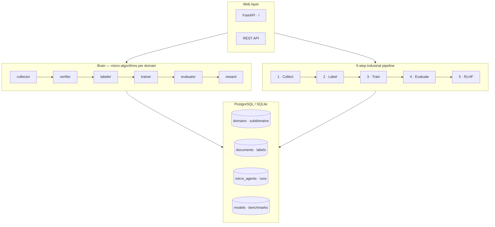

# Aureon-LLM

**Supervised machine learning that trains itself across every human knowledge domain.**

Aureon-LLM is not mystical “AI.” It is a production-oriented system built on **supervised learning**, **backpropagation**, and an industrial **5-step training pipeline** — wrapped in a **brain-inspired micro-agent architecture** where each region collects, verifies, labels, trains, evaluates, and rewards domain by domain.

Deploy on [Railway](https://railway.app) with PostgreSQL. Run locally in minutes.

---

## At a glance

| | |
|---|---|
| **Core engine** | Neural network with backpropagation (from scratch) |
| **Knowledge coverage** | 29 domains · 154 subdomains · 1,098 micro-agents |
| **Brain regions** | collector → verifier → labeler → trainer → evaluator → reward |
| **Pipeline steps** | collect → label → train → evaluate → RLHF |
| **Database** | PostgreSQL (Railway) or SQLite (local) |
| **Web UI** | FastAPI + interactive demos at `/` |

**Repositories**

- [ZorakCorp/Aureon-LLM](https://github.com/ZorakCorp/Aureon-LLM)
- [shep95/Aureon_Elion-LLM](https://github.com/shep95/Aureon_Elion-LLM)

---

## How it actually works

Traditional software: **you write the algorithm.**

```text
output = algorithm(input)     # e.g. 1 + 1 = 2
```

Supervised machine learning: **you provide inputs and correct labels.** The computer discovers weights via **backpropagation** — what the industry calls “deep learning” at scale.

```text
1. Provide inputs   (documents, face images, features)
2. Provide labels   (domain, person ID, match yes/no)
3. Backpropagation  adjusts weights until predictions match labels
```

Three constraints must hold or the system breaks:

1. **Clean data** — structured labels, not opinions  
2. **Measurable goal** — yes/no or class ID, not “what is good?”  
3. **Defined parameters** — a bounded, labeled database  

---

## System architecture



---

## The brain — micro-algorithms like specialized brain regions

Each **knowledge domain** and **subdomain** gets six specialized micro-agents. They run in sequence, share state through the database, and coordinate via the **cortex** (`brain/cortex.py`).

| Region | Role | What it does |
|--------|------|----------------|
| **collector** | Sensory input | Scrapes seeds, arXiv, Gutenberg, local inbox per domain |
| **verifier** | Critical filter | Quality, verifiability, consistency checks |
| **labeler** | Classification | Teacher model labels data; ~5–10% uncertain samples flagged for human review |
| **trainer** | Learning | Backpropagation trains a classifier per domain/subdomain |
| **evaluator** | Executive function | Reasoning, consistency, verification benchmarks; halts on regression |
| **reward** | Preference system | RLHF-style reward model scores preferred vs rejected outputs |

### Knowledge taxonomy

**29 top-level domains**, **154 subdomains**, **1,098 registered micro-agents**.

Examples:

- `mathematics` → algebra, calculus, topology, statistics…  
- `computer_science` → algorithms, machine_learning, security…  
- `biology` → genetics, neuroscience, molecular_biology…  
- `linguistics` → syntax, sanskrit_studies, computational…  
- `vedic_sciences` → jyotisha, vyakarana, darshana…  

Full tree: `brain/domains/taxonomy.py` · API: `GET /api/brain/taxonomy`

---

## The 5-step training pipeline

Industrial ML loops — the same pattern used at scale by major labs, implemented here in readable Python.

| Step | Name | Tools / pattern |
|------|------|-----------------|
| **1** | Automated data collection | Scrapers, filters, Kafka-ready queue |
| **2** | Automated labeling | Teacher–student distillation + active learning |
| **3** | Automated training | Model registry, auto-promote on improvement |
| **4** | Automated evaluation | Benchmark gates; alerts on score drop |
| **5** | RLHF approximation | Reward model replaces human raters |

```bash
python run_pipeline.py              # all 5 steps
python run_pipeline.py --step 3     # single step
```

---

## Face ML demos (lecture reference)

Interactive demos for supervised learning fundamentals — facial recognition as the worked example:

| Demo | Description |
|------|-------------|
| **Synthetic features** | Eye / nose / chin weights discovered by backprop |
| **Binary face match** | Measurable yes/no: same person? |
| **Person ID** | Multi-class classification + edge-case fragility |

Powered by a from-scratch neural network in `src/neural_network.py` — no PyTorch required for core learning.

```bash
python train.py
python train.py --mode synthetic
```

---

## Quick start

### Prerequisites

- Python 3.12+
- pip

### Install & run locally

```bash
git clone https://github.com/ZorakCorp/Aureon-LLM.git
cd Aureon-LLM
pip install -r requirements.txt

# Initialize database + seed 29 domains
python scripts/init_db.py

# Web UI + API
uvicorn app.main:app --reload --port 8000
```

Open **http://localhost:8000**

### Brain CLI

```bash
python run_brain.py --status
python run_brain.py --domain computer_science --subdomain machine_learning
python run_brain.py --domain-limit 5 --subdomain-limit 2
```

---

## Deploy on Railway

### 1. Web service

1. [railway.app](https://railway.app) → **New Project** → **Deploy from GitHub**  
2. Connect [ZorakCorp/Aureon-LLM](https://github.com/ZorakCorp/Aureon-LLM) or [shep95/Aureon_Elion-LLM](https://github.com/shep95/Aureon_Elion-LLM)  
3. Railway detects Python via `requirements.txt` and starts via `Procfile` / `railway.toml`  
4. **Settings → Networking → Generate Domain**

### 2. PostgreSQL

1. **+ New → Database → PostgreSQL**  
2. On the web service, add variable:  
   `DATABASE_URL=${{Postgres.DATABASE_URL}}`  
3. Redeploy — tables and taxonomy seed automatically on startup  

Without Postgres, the app falls back to SQLite at `data/aureon.db`.

### Environment variables

| Variable | Required | Purpose |
|----------|----------|---------|
| `DATABASE_URL` | Railway Postgres | Domain tree, documents, agents, models |
| `PORT` | Auto-set by Railway | HTTP port |
| `KAFKA_BOOTSTRAP_SERVERS` | Optional | Kafka instead of local JSONL queue |
| `ALERT_WEBHOOK_URL` | Optional | Webhook when benchmarks fail |
| `PIPELINE_DATA_DIR` | Optional | Override local data directory |

---

## API reference

### Health

| Method | Path | Description |
|--------|------|-------------|
| `GET` | `/health` | Liveness check |

### Brain

| Method | Path | Description |
|--------|------|-------------|
| `POST` | `/api/brain/bootstrap` | Seed domains + micro-agents |
| `GET` | `/api/brain/status` | Domains, agents, document counts |
| `GET` | `/api/brain/taxonomy` | Full knowledge tree |
| `POST` | `/api/brain/run` | Run micro-agents across domains |
| `POST` | `/api/brain/domain/{domain}` | Run all subdomains in one domain |
| `POST` | `/api/brain/domain/{domain}/{subdomain}` | Run one subdomain circuit |

### Pipeline

| Method | Path | Description |
|--------|------|-------------|
| `POST` | `/api/pipeline/run` | Run all 5 pipeline steps |
| `POST` | `/api/pipeline/step/{1-5}` | Run a single step |
| `GET` | `/api/pipeline/status` | Production model + latest run |

### ML demos

| Method | Path | Description |
|--------|------|-------------|
| `GET` | `/api/concepts` | Supervised ML concepts (JSON) |
| `POST` | `/api/demo/synthetic` | Eye/nose/chin weight demo |
| `POST` | `/api/demo/match` | Binary face matching |
| `POST` | `/api/demo/identify` | Person ID + edge case |

---

## Project structure

```text
Aureon-LLM/
├── app/                    # FastAPI web app (Railway entry)
│   ├── main.py
│   ├── service.py          # Face ML demos
│   ├── pipeline_routes.py
│   └── brain_routes.py
├── brain/                  # Micro-agent architecture
│   ├── cortex.py           # Orchestrator
│   ├── base.py
│   ├── domains/taxonomy.py # 29 domains · 154 subdomains
│   └── regions/            # collector, verifier, labeler, …
├── db/                     # PostgreSQL / SQLite
│   ├── models.py
│   ├── session.py
│   └── seed.py
├── pipeline/               # 5-step industrial pipeline
│   ├── step1_collection/
│   ├── step2_labeling/
│   ├── step3_training/
│   ├── step4_evaluation/
│   └── step5_rlhf/
├── src/                    # Core ML
│   ├── neural_network.py   # Backpropagation from scratch
│   ├── text_features.py
│   ├── synthetic_faces.py
│   └── face_matcher.py
├── data/seeds/             # Bundled primary-source seed corpus
├── scripts/init_db.py
├── run_brain.py
├── run_pipeline.py
├── train.py
├── Procfile
├── railway.toml
└── requirements.txt
```

---

## Database schema

| Table | Purpose |
|-------|---------|
| `knowledge_domains` | Top-level domains (math, physics, …) |
| `knowledge_subdomains` | Sub-domains under each |
| `micro_agents` | One row per region × domain × subdomain |
| `documents` | Collected, filtered text |
| `document_labels` | Teacher labels + human-review flags |
| `training_runs` | Per-domain model artifacts |
| `benchmark_results` | Evaluation scores |
| `preference_pairs` | RLHF preference data |
| `pipeline_events` | Event log (Kafka-compatible) |

---

## Data sourcing principles

Quality beats geography. The system is designed for:

- **Domain specificity** — math from arXiv, IIT, MIT; all valid if on-topic  
- **Primary sources** — original papers and texts over summaries  
- **Source diversity** — no single institution dominates the corpus  
- **Peer review & verifiability** — verifier region enforces quality signals  
- **Multilingual coverage** — Sanskrit, Arabic, Chinese sources encode different reasoning structures  

Trusted starting points: [arXiv](https://arxiv.org), Project Gutenberg, Wikipedia dumps, GitHub, Stack Overflow (respect licenses).

Drop custom `.txt` / `.md` files into `data/raw/inbox/` to ingest locally.

---

## What this is not

- Not AGI, consciousness, or magic — supervised learning with weights and labels  
- Not a replacement for human review on high-stakes domains — active learning keeps humans in the loop  
- Not dependent on a single geography or institution — diversity of vetted sources matters  

---

## License

MIT — use, fork, and deploy freely. Attribution appreciated.

---

<p align="center">
  <strong>Aureon-LLM</strong> · supervised learning · brain micro-agents · every human domain<br/>
  <a href="https://github.com/ZorakCorp/Aureon-LLM">ZorakCorp/Aureon-LLM</a> ·
  <a href="https://github.com/shep95/Aureon_Elion-LLM">shep95/Aureon_Elion-LLM</a>
</p>
